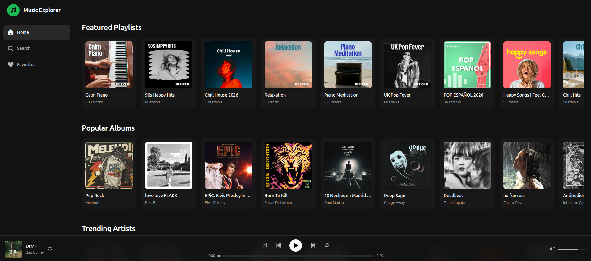
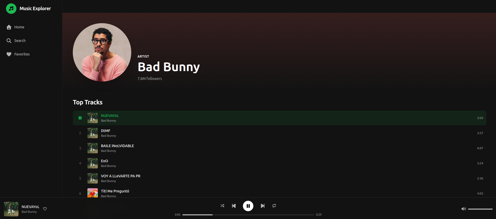
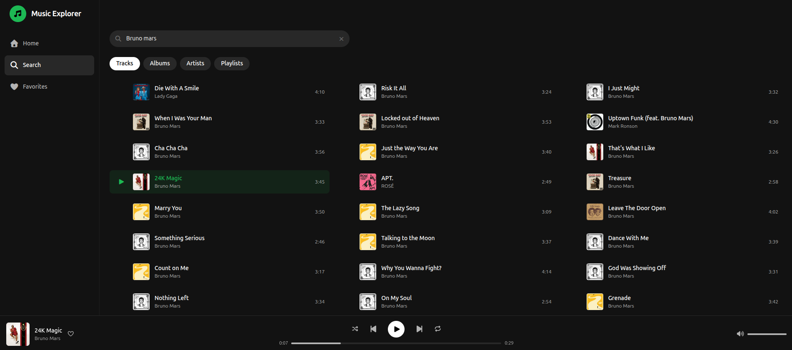

# Music Explorer

A web app for exploring music, powered by a Vue 3 frontend and a PHP backend that acts as a proxy for the Deezer API.

## Screenshots







## Prerequisites

- [Docker](https://docs.docker.com/get-docker/) and Docker Compose v2

## Getting Started

```bash
# Start both services
docker compose up -d

# The frontend will be available at:
#   http://localhost:5173
# The backend API will be available at:
#   http://localhost:8082
```

Rebuild after Dockerfile changes:

```bash
docker compose up -d --build
```

## Running Tests

### Frontend (Vitest)

```bash
docker compose exec music-explorer-frontend npm run test:unit
```

### Backend (PHPUnit)

```bash
docker compose exec music-explorer-backend ./vendor/bin/phpunit
```

## Project Structure

```
music-explorer/
├── frontend/          # Vue 3 SPA (Vite, Pinia, Tailwind CSS v4)
├── backend/           # PHP API (Slim 4, Deezer proxy)
└── docker-compose.yml
```
